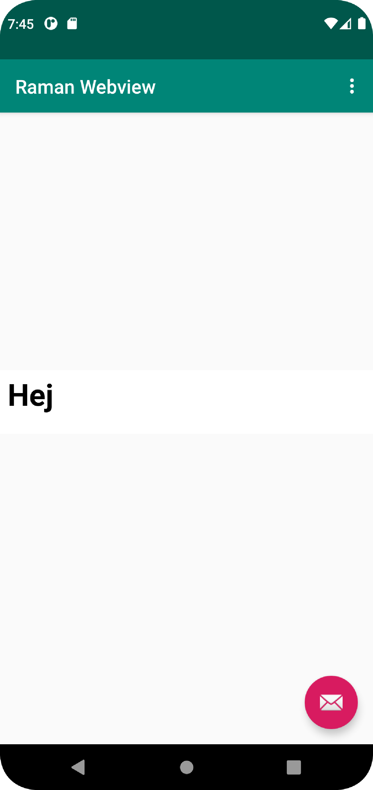

# Rapport

**Skriv din rapport här!**

The assignment started with renameing the app by going into the **res/values/strings.xml**. The app was renamed to `Raman webview`.
There after I'd had to enable internet acces by going into the **/manifest/AndroidManifest.xml** and copied pasted `<uses-permission android:name="android.permission.INTERNET" />`.
I also changed the content_main.xml from `Textview` to `Webview`. I did also input inside the Webview an id `android:id="@+id/my_webview"`. Which was initiated in the **MainActivity.java** as private of the type WebView.

```
 <WebView
        android:id="@+id/my_webview"
        android:layout_width="wrap_content"
        android:layout_height="wrap_content"
        android:text="Hello World!"
        app:layout_constraintBottom_toBottomOf="parent"
        app:layout_constraintLeft_toLeftOf="parent"
        app:layout_constraintRight_toRightOf="parent"
        app:layout_constraintTop_toTopOf="parent" />

</androidx.constraintlayout.widget.ConstraintLayout>
```

I enabled javascript with help of the id:

```java
myWebView = findViewById(R.id.my_webview);
myWebView.getSettings().setJavaScriptEnabled(true);
myWebView.setWebViewClient(new WebViewClient());
```

A folder called asset which inside has a folder named html. The reasoning having another file inside of asset was because I thought that this folder might hold other type of asset also, such as img, css or javascript files. (**/assets/html/about.html**)
There after we called **loadUrl()** in both **showExternalwebpage** and **showInternalwebpage**. Which the method was called upon inside **onOptionsItemSelected** function. 
```java
   public void showExternalWebPage(){
        // TODO: Add your code for showing external web page here
        myWebView.loadUrl("https://ramanmohammed.com");


    }

    public void showInternalWebPage(){
        // TODO: Add your code for showing internal web page here
        myWebView.loadUrl("file:///android_asset/html/about.html");
        
    }
```




